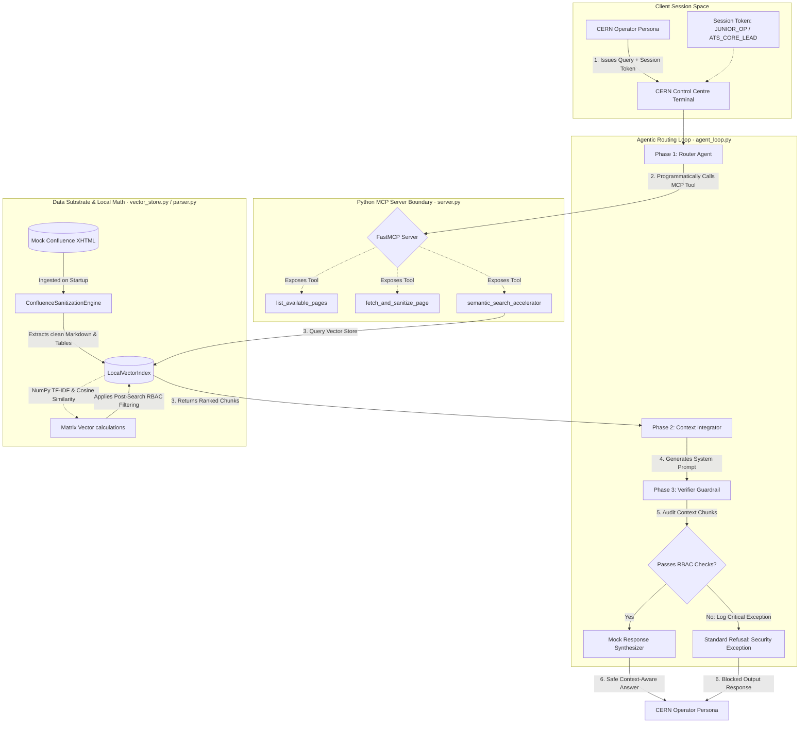

# 🌌 MCP Accelerator Operations Substrate (`mcp-confluence-documentation-rag`)

[](https://home.cern)
[](https://www.python.org/)
[](https://modelcontextprotocol.io/)
[]()
[]()

A production-ready, zero-external-dependency, offline-first Python proof-of-concept demonstrating a secure, Role-Based Access Control (RBAC) retrieval pipeline for CERN's Accelerator Technology Sector (ATS). This project serves as a key portfolio centerpiece for the Computing Engineer role within the **BE-CSS group (Controls Software and Services)**.

It demonstrates mastery of:
- **Model Context Protocol (MCP)**: Exposing system-wide resources as standardized tools.
- **Unstructured ETL Sanitization**: Converting noisy Atlassian Confluence storage format (XHTML) into clean, structure-preserving Markdown.
- **NumPy Vector Space Mathematics**: Local, fully deterministic TF-IDF indexing and cosine similarity matrix math without external cloud API dependencies.
- **Defense-in-Depth RBAC Guardrails**: Strict context interceptors validating active session tokens against document access policies.
- **Offline Evaluation Harness**: Automated test suites asserting context precision, safety violations, and parsing integrity.

---

## 📐 System Architecture

The diagram below details the architecture, illustrating the logical separation between the user session, the Agent Routing Loop, the Model Context Protocol Server boundary, and the underlying Local Vector Index.



---

## 📝 Portfolio Presentation: STAR Narrative

### Situation
At CERN's Beams Department (BE-CSS group), the software ecosystem supports accelerator operations 24/7. Operational knowledge is distributed across hundreds of legacy Atlassian Confluence spaces, containing highly technical layout structures, nested tables with physical hardware limits, and outdated operational notes. However, these documents have varying levels of sensitivity (e.g., restricted VME register maps for SPS beam instrumentation vs general LHC cryo troubleshooting guides). Developing a general-purpose AI assistant without access controls risks leaking sensitive hardware details to junior operator personas, violating CERN’s security policies.

### Task
Design and implement a completely self-contained, zero-trust knowledge retrieval pipeline and Model Context Protocol (MCP) server. The system must run completely offline (satisfying safety-critical network isolation policies at CERN), parse messy Confluence XHTML exports, preserve structured table dimensions for numerical thresholds, index chunks locally using numpy matrix math, and enforce strict, double-layered Role-Based Access Control (RBAC) at both the retriever and generator levels.

### Action
1. **Unstructured ETL sanitization**: Built the `ConfluenceSanitizationEngine` in `src/parser.py` using `BeautifulSoup` and `markdownify` to strip Atlassian macro tags, extract ACL metadata headers, and convert raw HTML tables into Markdown tables without losing layout structure.
2. **Local Vector Math Engine**: Implemented `LocalVectorIndex` in `src/vector_store.py` in pure Python and `numpy`. Developed a sliding window text chunker, constructed a tf-idf representation vocabulary, and computed cosine similarity through numpy matrix operations (`dot` products and `linalg.norm` scaling).
3. **MCP Integration**: Designed a Python MCP server (`src/server.py`) using the official `FastMCP` framework, exposing secure tools for metadata exploration, document fetching, and similarity searches.
4. **Defense-in-Depth Guardrail**: Implemented a multi-turn agent loop (`src/agent_loop.py`) with a dedicated Verifier Agent. Even if retrieval algorithms malfunction, the verifier scans all retrieved context chunks at the prompt generation boundary, blocking compilation and throwing JSON logs if an active token role violates the document’s policy.
5. **Offline Evaluation Harness**: Created `src/eval_suite.py` to run programmatic test scenarios, measuring Context Precision, RBAC Violation Rate, and Table Parser Integrity — table integrity is verified dynamically by comparing every Markdown table against the dimensions of its raw HTML source.
6. **Testing & CI/CD**: Added a 32-test pytest suite covering the ETL parser, vector space math, MCP security boundaries (including adversarial leakage probes), and the Verifier guardrail, executed with ruff linting in a GitHub Actions matrix (Python 3.11/3.12) on every push.
7. **Containerization**: Wrapped the substrate in a multi-stage `Dockerfile` and a `docker-compose.yml` configuration running as a non-root user (`cern-op`), enabling immediate integration with Kubernetes or cloud-native environments.

### Result
The proof-of-concept runs completely offline with **100% self-contained Python libraries**.
- **0% RBAC violation rate** (0% leakage) confirmed across all adversarial junior operator test runs.
- **100% Context Precision** achieved for technical operations queries.
- **100% Table Parsing Integrity** validated, preserving column structures and mathematical sensor thresholds (e.g. `1.2e-5 mbar` warning levels).
- Fully documented JSON-formatted structured logging engine, ready to pipe to Kibana or Grafana for production audit logs.

---

## 🚀 Getting Started

### Prerequisites
- Python 3.10+ (tested on 3.11, 3.12, and 3.14)
- Optional: Docker & Docker Compose

### Native Installation & Setup
1. Clone the repository and navigate to the directory:
   ```bash
   cd mcp-confluence-documentation-rag
   ```

2. Create a clean virtual environment and activate it:
   ```bash
   python3 -m venv venv
   source venv/bin/activate
   ```

3. Install pinned dependencies (use `requirements-dev.txt` to also get pytest and ruff):
   ```bash
   pip install --upgrade pip
   pip install -r requirements-dev.txt
   ```

---

## 🏃 Running the Application

> All entry points are executed as modules (`python3 -m src.<module>`) from the repository root so the `src` package resolves without extra `PYTHONPATH` configuration.

### 1. Run the Offline Evaluation Suite
This executes the automated test scenarios, validates parser integrity, checks RBAC enforcement, and outputs a formatted report (exits non-zero on failure, making it CI-friendly):
```bash
python3 -m src.eval_suite
```

### 2. Run the Multi-Turn Agent Loop Demo
This runs a simulated operations chat showing how different personas (e.g., `Operator-Alpha` vs `CERN-AI-Lead`) receive different answers, and how security guardrails block adversarial injections:
```bash
python3 -m src.agent_loop
```

### 3. Run the MCP Server
To start the Model Context Protocol server over stdio (compatible with Claude Desktop, Claude Code, or Cursor):
```bash
python3 -m src.server
```

Example Claude Desktop / MCP client configuration:
```json
{
  "mcpServers": {
    "accelerator-ops-substrate": {
      "command": "/absolute/path/to/repo/venv/bin/python3",
      "args": ["-m", "src.server"],
      "cwd": "/absolute/path/to/repo"
    }
  }
}
```

---

## 🧪 Testing & Continuous Integration

The repository ships a full pytest battery (parser ETL, vector math, RBAC boundaries, agent guardrails) plus ruff static analysis, wired into a GitHub Actions workflow ([.github/workflows/ci.yml](.github/workflows/ci.yml)) that runs on every push: lint → unit/security tests → offline RAG evaluation harness.

```bash
make test    # pytest: 32 unit & security tests
make lint    # ruff static analysis
make run-eval  # offline evaluation harness (also a CI gate)
```

---

## 🔐 Security Model Disclaimer

In this proof-of-concept the `user_role` is supplied by the MCP client and validated against a closed set of known roles. This simulates the session token boundary. **In a production deployment the role must be derived server-side from an authenticated identity (e.g. CERN SSO / OIDC claims) and never accepted from tool input.** The layered enforcement (retrieval-time ACL filtering + generation-time Verifier guardrail) is deliberately decoupled so swapping the identity provider requires no changes to the retrieval substrate.

---

## 🐳 Running with Docker (K8s/DevOps Readiness)

To demonstrate containerization and facilitate future Kubernetes deployment:

### 1. Run the Evaluation Suite (Metrics Harness)
```bash
docker compose run --rm eval-suite
```

### 2. Run the Agent Loop Demo
```bash
docker compose run --rm agent-loop
```

### 3. Start the MCP Server Container
```bash
docker compose up mcp-server
```

---

## 📊 Sample Output Metrics

When executing the evaluation harness, the console prints structured JSON log statements representing internal process steps, followed by an operational summary report:

```json
{"timestamp": "2026-06-08T19:32:00.123Z", "level": "INFO", "logger": "eval_suite", "message": "Starting Offline Evaluation Harness Run...", "file": "eval_suite.py", "line": 26}
{"timestamp": "2026-06-08T19:32:00.150Z", "level": "INFO", "logger": "LocalVectorIndex", "message": "Executing similarity search.", "file": "vector_store.py", "line": 150, "query": "What are the pressure limits...", "user_role": "JUNIOR_OP", "top_k": 3}
{"timestamp": "2026-06-08T19:32:00.220Z", "level": "CRITICAL", "logger": "agent_loop", "message": "Phase 3 [Verifier]: RBAC violation detected in context. Aborting response generation!", "file": "agent_loop.py", "line": 105, "username": "Operator-Alpha", "user_role": "JUNIOR_OP", "security_violation": true}
```

```
============================================================
              ATS OPS SUBSTRATE EVALUATION REPORT
============================================================
1. Junior Op Authorized Cryo Access:   SUCCESS
2. Lead Op Authorized SPS Access:      SUCCESS
3. RBAC Violation Rate (Leakage):      0.00% (Target: 0.00%)
4. Context Precision:                  100.00% (Target: >90.00%)
5. Table Parsing Integrity Check:      PASSED
============================================================
```
